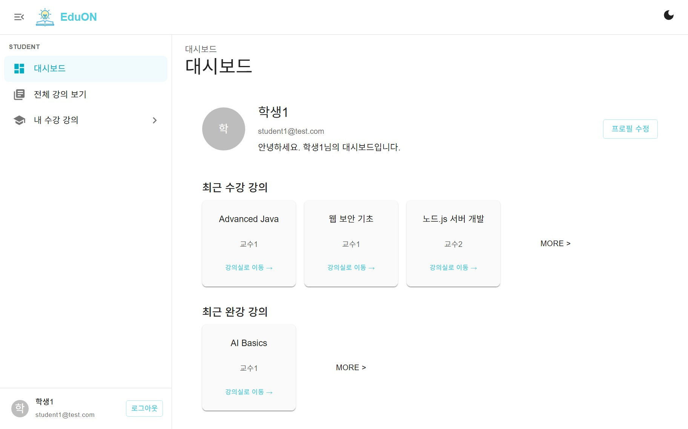
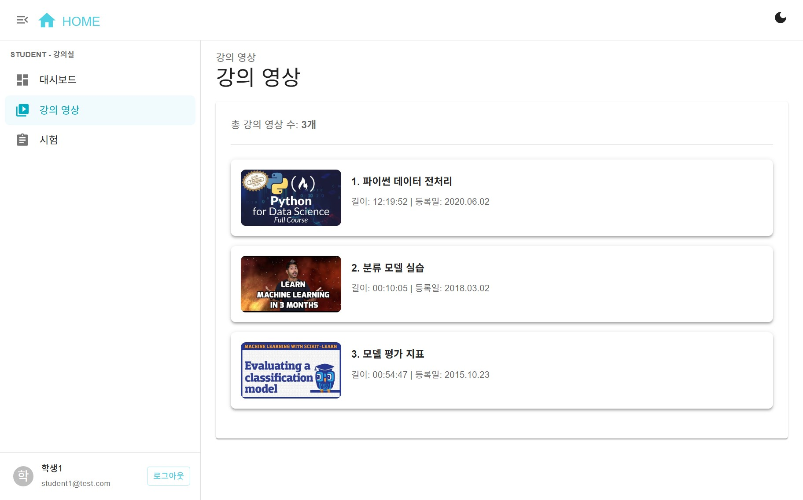
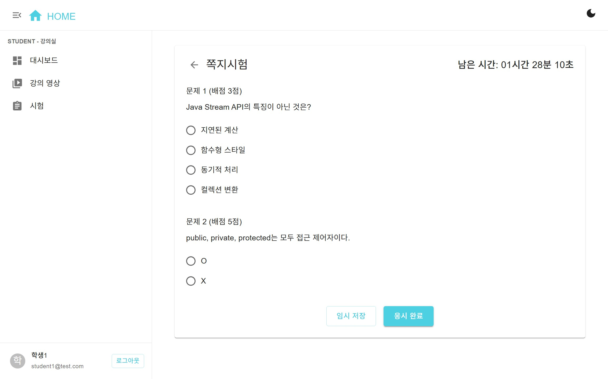

# Online Learning Platform - Frontend

> **온라인 평생학습 플랫폼의 프론트엔드(React) 프로젝트**
>
> 교육자와 학습자를 위한 강의, 시험, 출결, 회원 관리 등 다양한 기능을 제공합니다.

---

## 📝 프로젝트 소개

이 프로젝트는 온라인 평생학습 플랫폼의 **프론트엔드**(React)만을 담당합니다.

- **백엔드 서버는 별도 프로젝트**([Backend-Online-Learning](https://github.com/Clean314/Backend-Online-Learning))에서 Tomcat 기반으로 동작합니다.
- 본 프론트엔드와 백엔드는 REST API로 통신합니다.

---

## 🚀 주요 기능(Features)

- 역할 기반 회원가입/로그인 (학생, 교수자, 관리자)
- 강의 목록/상세/신청/출결/영상 시청
- 시험 출제/응시/자동 채점
- 관리자용 회원/강의 관리, 통계 대시보드
- 반응형 UI, 다크모드 지원

---

## 🛠️ 기술 스택(Tech Stack)

- **Frontend**: React 18, Vite, React Router, Context API
- **UI**: MUI(Material UI), CSS Modules
- **상태관리**: Context, Custom Hooks
- **API 통신**: Axios
- **기타**: Prettier, ESLint

---

## 🖼️ 스크린샷

**대시보드(학생)**  


**강의 영상 목록**  


**시험 응시 화면**  


**전체 페이지 구성**
[Figma에서 전체 페이지 확인하기](https://www.figma.com/design/aJGGTaSmPOcGxivXhN3tvv/%EC%9D%B4%ED%8A%9C---%EC%9B%B9%EA%B8%B0%EB%B0%98-%EC%98%A8%EB%9D%BC%EC%9D%B8-%ED%8F%89%EC%83%9D%ED%95%99%EC%8A%B5-%ED%94%8C%EB%9E%AB%ED%8F%BC?node-id=0-1&t=LFoI7yAO2Xqd6SqV-1)

---

## 📁 폴더 구조

- [docs/folder-structure.md](./docs/folder-structure.md) 참고

---

## 시스템 구성

```
[사용자 브라우저]
      │
      ▼
[본 프로젝트: frontend (React)]
      │  (REST API)
      ▼
[백엔드: Backend-Online-Learning (Spring Boot, Tomcat)]
```

- **프론트엔드**: React + Vite 기반 SPA
- **백엔드**: Java Spring Boot, Tomcat (별도 서버)

---

## 백엔드 연동 및 개발 환경 안내

1. **백엔드 서버 실행**
    - [Backend-Online-Learning](https://github.com/Clean314/Backend-Online-Learning) 저장소의 안내에 따라 Tomcat 서버를 먼저 실행하세요.
    - 기본 API 서버 주소: `http://localhost:8989`
2. **프론트엔드 실행**
    - 아래 안내대로 npm 명령어로 실행
    - `npm install` : 라이브러리 설치
    - `npm run dev` : 개발 모드로 실행
3. **Youtube Data API 사용**
    - `.env.local` 파일을 생성해 Youtube Data API Key(`VITE_YOUTUBE_API_KEY`)를 저장해 주세요.

---
